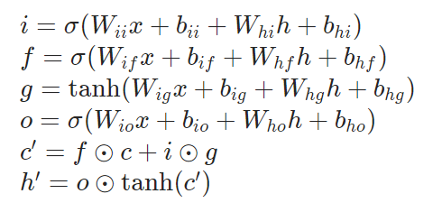

# 神经网络基础
本次拟合对象为sine函数，为拟合这种非线性函数CNN网络会面临非训练部分难以拟合的问题，
因此我们使用LSTM网络将该问题转换为一种时间序列预测的问题，从而拟合sine函数。

## 代码使用
```shell
python generate_sine_wave.py
python lstm_sine_fit.py
```


## 数据生成脚本说明

`generate_sine_wave.py` 脚本用于生成用于训练和测试的正弦波数据。
定义了生成正弦波的参数：
- `T`：正弦波的周期，默认值为 20
- `L`：每个信号的长度，默认值为 1000
- `N`：生成的信号数量，默认值为 100

生成 `N` 个长度为 `L` ,初始值在上下四个`T`内随机的信号，并将其转换为正弦波数据。

生成的正弦波数据保存到 `datasets/traindata.pt` 文件中，以便后续训练和测试使用。

## LSTM网络拟合正弦函数
### LSTM Cell 结构

我们将1维的输入数据输入网络映射为`hidden_size`的大小，之后通过上述LSTM Cell遗忘门进行处理，循环处理`layers`次，最后通过全连接层输出结果。

### 超参数
通过argparse.ArgumentParser()参数化，参数如下。
- `steps`：运行的步数，默认值为 15。
- `lr`：学习率，默认值为 0.8。
- `layers`：LSTM 网络的层数，默认值为 2。
- `hidden_size`：隐藏层的大小，默认值为 51。
- `device`：运行设备，默认值为 `cuda`。
- `mode`：运行模式，默认值为 `TrainAndTest`。可选择输入`TrainAndTest`、`Validate`,后者只会进行测试。

每个epoch的测试结果会绘制成jpg图片保存在predictions文件夹中，每轮训练过程的loss会被wandb记录。

完整参数训练示例如下：
```shell
python lstm_sine_fit.py --steps 15 --lr 0.8 --layers 2 --hidden_size 51 --device cuda --mode TrainAndTest
```
测试示例如下(请确保模型参数一致)：
```shell
python lstm_sine_fit.py --mode Validate
```

选择了以下超参数编写shell脚本进行对比实验
```shell
python lstm_sine_fit.py --steps 20 --lr 0.8 --layers 2 --hidden_size 51
python lstm_sine_fit.py --steps 20 --lr 0.8 --layers 2 --hidden_size 32
python lstm_sine_fit.py --steps 20 --lr 0.8 --layers 2 --hidden_size 64
python lstm_sine_fit.py --steps 20 --lr 0.1 --layers 2 --hidden_size 51
python lstm_sine_fit.py --steps 20 --lr 0.2 --layers 2 --hidden_size 51
python lstm_sine_fit.py --steps 20 --lr 0.5 --layers 2 --hidden_size 51
python lstm_sine_fit.py --steps 20 --lr 0.8 --layers 3 --hidden_size 64
python lstm_sine_fit.py --steps 20 --lr 0.8 --layers 4 --hidden_size 64
python lstm_sine_fit.py --steps 20 --lr 0.8 --layers 5 --hidden_size 64
```

以超参数`--steps 20 --lr 0.8 --layers 2 --hidden_size 51`为例测试结果如下:


wandb图表如下


通过wandb中loss的分析我们可以获得以下发现:
- 前三组训练效果排序为 `--hidden_size 64` > `--hidden_size 32` > `--hidden_size 51`，说明隐藏层大小对于模型的拟合效果有一定影响，并且2的整数次幂效果优于其他整数。
- 学习率对于模型的拟合效果有一定影响，`--lr 0.1`loss值一直大于其他组可知过小会导致拟合过慢。
- 训练效果最好的组为`--steps 20 --lr 0.8 --layers 3 --hidden_size 64`,说明一定程度上加大参数量会提高拟合效果。
- 隐藏层大小对于模型的拟合效果有一定影响，`--layers 5 --hidden_size 64`训练爆炸可知过大会导致拟合效果变差。

## Docker运行
本项目配置了`docker`环境，首先请GPU模式启动镜像并实例化容器

之后进入容器内部，输入`wandb login --relogin`登录wandb账号，之后即可运行代码。
以下为示例运行命令：
```shell
cd FunctionFitFinal
python generate_sine_wave.py
python lstm_sine_fit.py
```